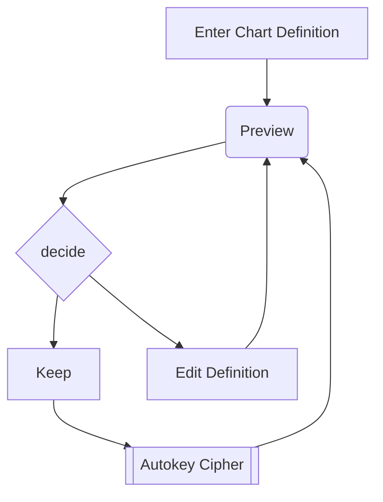

- Network security is the protection of information, and systems and ahrdware that use store and transmit that information
- Security engineering is about building systems to
remain dependable in the face of malice, error and
mischance
Dependability = reliability + security
 - What are we trying to do = policies
 - how = protcols
 - with what = tools
- CIA
	- Confidentiality - Can be read and understood only by the intended parties/legal recipients
		- Threats
			- Passive
				- Snooping
				- Traffic Analysis
		- Services
			- Encipherment
			- Routing Control
	- Integrity - correctness/completeness
		- Threats
			- Active
				- Modification
				- Masquerading - impersonation
				- Replaying
				- Requdiation - denying that the message was sent/received by the sender/receiver
					- Proof of origin
					- Proof of delivery
		- Services
			- Anti change
			- Anti replay
			- Digital Signature
	- Availability - available to the intended parties with minimal delay
		- Threats
			- Active
			- Denial of Service
	- Additionally
		- Authentication
		- Non repudiation
			- Services
				- Notarization
- Cybercrime-as-a-service Model
	- Access as a service (AaaS) provides access to stolen account credentials and systems through remote access using remote desktop protocol (RDP) or VPNs.
	- Malware distribution as a service facilitates deployment of various types of malware in certain regions. This is made possible using vulnerability exploits, AaaS and attacks like the watering-hole attack (infect targeted users by injecting malicious code into websites/services they frequently visit).
	- Phishing as a service provides tools/services to create cloned websites, phishing emails that bypass the spam filters.
	- OPSEC as a service provides operational security (a security and risk management process on sensitive information) to attackers to minimize detection and ability to be traced back to the source.
	- Crypting as a service provides encryption for malware so it can bypass detection.
	- Scamming as a service provides the necessary tools and platforms (emails, fake websites) to perform scams.
	- Vishing (voice phishing) as a service provides a voice system with AI integrations to trick individuals into providing sensitive information over a telephone service.
	- Spamming as a service provides bulk spamming through SMS or email. Some providers offer the entire infrastructure required such as the mail server and botnet (a network of devices which are infected without the owners’ knowledge).
	- Scanning as a service provides cheap access to commercially available tools in order to find and exploit vulnerabilities.

Types of Attacks
 - According to personell??
	 - Structured
	 - Unstructured
 - According to origin??
	 - External
	 - Internal
 - According to actions??
	 - Passive - Only reading
	 - Active - Reading + modifying

Types of DDoS attacks
 - Buffer Overflow Attacks - characterized by the overwriting of memory fragments of the process, which should have never been modified intentionally or unintentionally
 - SYN Flood Attack - attacker sends a succession of SYN requests to a target's system in an attempt to consume enough server resources to make the
system unresponsive to legitimate traffic.
 - Teardrop Attacks - Send fragmented packets that cannot be reassembled by the receiver causing the network device to crash
 - Smurf Attack
 - DNS Attacks
 - Email Attacks
 - Physical Infrastructure Attacks
 - Viruses/Worms

Stages of an attack
 - Reconnaissance
– Scanning (addresses, ports, vulnerabilities)
– Gaining access
– Maintaining Access
– Covering Tracks

Tools of an attack
– Enumeration tools (dumpreg, netview and netuser)
– Port/address scanners (AngryIP, nmap, Nessus)
– Vulnerability scanners (Meta Sploit, Core Impact, ISS)
– Packet Sniffers (Snort, Wire Shark, Air Magnet)
– Root kits
– Cryptographic cracking tools (Cain, WepCrack)
– Malicious codes (worms, Trojan horse, time bombs)
– System hijack tools (netcat, MetaSploit, Core Impact)
– LATEST: all these as-a-service

Countermeasures
- DMZ/NAT
• IDS/IPS
• Content Filtering
• Firewalls/proxy services
• Authentication/Authorization/Accounting (AAA)
• Self-defending networks
• Policies, procedures, standards guidelines
• Training and awareness

Countermeasure selection
ALE = anual loss expectancy
(ALE before implementing safeguard) – (ALE after implementing safeguard) – (annual cost of safeguard) = value of safeguard to the company
Calculating cost
Product costs
– Design/planning costs
– Implementation costs
– Environment modifications
– Compatibility
– Maintenance requirements
Testing requirements
– Repair, replacement, or update costs
– Operating and support costs
– Effects on productivity

### Information Security Model
McCumber Cube
Properties: CIA
States: Processing, Storage, Transmission
Measures:
 - Policies and Procedures
 - Technology
 - Education,  Training and Awareness

### Access Control

A system that enablesan authority to control access
 - By users (subjects)
 - To system resources (objects)
 - Based on a security policy (access control matrix)

AAA principle
 - Authentication
	 - confirming identity of the subject
	 - based on
		 - what you know (PIN, password)
		 - what you have (access card)
		 - what you are (iris, fingerprint, voice)
		 - where you are (inside firewall, geolocation)
		 - what you do (e.g. draw a pattern)
	 - Single factor, dual factor, multi factor
	 - multi-factor vs multi step
 - Authorization
	 - Determine what the subject can do
 - Accountability
	 - Associating a subject with its actions
	 - To detect and/or recreate security violations
	 - E.g., audit trails of failed login attempts or blocked traffic

Read CNS05_NetworkAccessControl.pdf again!!!
#TODO
Add notes from Threat Report Assignment
#TODO 

![[WhatsApp Image 2023-12-22 at 7.36.50 AM.jpeg]]